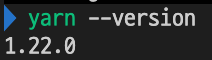
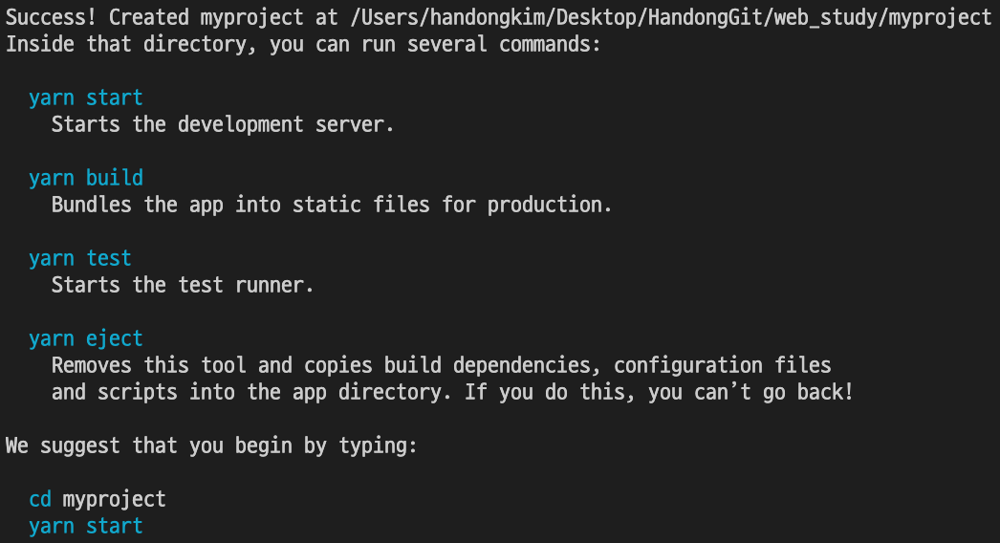

## React JS Study

Javascript Frontend framework React.js

### Settings

If you don't use Mac OS or install the homebrew, you need to find other ways to setting.

1. Install yarn

    `brew install yarn`

    Then, open your terminal(iterm etc) check npm and yarn is successfully installed.

    `yarn --version`

    You can see each libraries belows.

    

    If you can't see the version, go to official site and search how to solve the problems

    [yarn documentation](https://yarnpkg.com/getting-started)

    If you already downloaded npm, it is possible to use npm.

2. Install create-react-app

    If you don't want to download it, you can add only one line. It is useful when you just want to study React.
    
    ```
    <script crossorigin src="https://unpkg.com/react@16/umd/react.development.js"></script>
    <script crossorigin src="https://unpkg.com/react-dom@16/umd/react-dom.development.js"></script>
    ```

    If you want to start your own React project, you need to download create-react-app by yarn or npm.

    `yarn install global create-react-app`

    If you don't want to use globally, *global* keyword can be excepted.

3. Create react project and make your own product!

    If you download all above, type

    `create-react-app <your project name>`.

    then, your project folder is created. When you create your project, your project name must not contain capital letters.

    Your project is just opened!

    


### React basic

* Index

    1. [Hello world!]()

    2. [What is JSX?]()

    3. [Component, props, state]()

    4. [Lifecycle API]()

    5. [How to deal with Event]()

